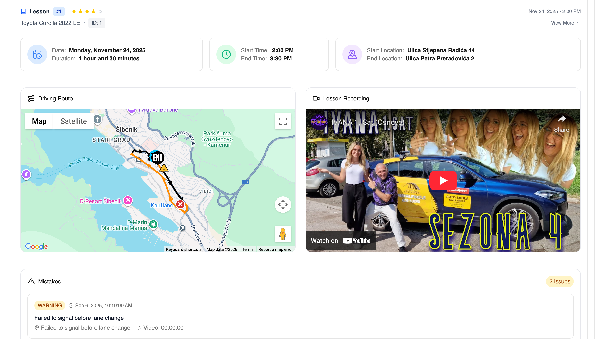

# 3. Laboratorijska vježba  
**Autor:** Jure Rajčić

## Vizualizacija GPS rute vožnje pomoću Google Maps i Firebasea

## 1. Uvod  
U sklopu ove laboratorijske vježbe razvijen je sustav za vizualizaciju vožnje kandidata autoškole na interaktivnoj karti. Sustav omogućuje pregled rute kretanja vozila, označavanje pogrešaka tijekom vožnje te prikaz osnovnih statističkih podataka. Cilj sustava je olakšati analizu vožnje instruktorima te omogućiti kandidatima bolji uvid u vlastiti napredak.

## 2. Korištene tehnologije  
U izradi aplikacije korištene su sljedeće tehnologije:

- **Angular**  
  Frontend administracijska aplikacija  

- **Firebase**  
  Firestore baza podataka, Firebase Functions i Firebase Emulator  

- **Google Maps API**  
  Prikaz i obrada karata  

- **Node.js i npm**  
  Upravljanje paketima i pokretanje aplikacije  

## 3. Pokretanje aplikacije  
Za ispravno pokretanje aplikacije potrebno je izvršiti sljedeće naredbe:

```bash
npm install               # Instalira sve potrebne pakete i ovisnosti projekta
npm run start             # Pokreće Angular frontend aplikaciju
npm run start emulators   # Pokreće Firebase emulatore (bazu i serverless funkcije)
npm run emulators:seed    # Inicijalizira bazu podataka testnim (simulacijskim) podacima
```

## 4. Konfiguracija okoline (VAŽNO)

Svaki korisnik koji projekt pokreće lokalno mora prilagoditi konfiguracijsku datoteku:

```text
environment/environment.dev.ts
```

Datoteka već sadrži ispravnu strukturu, ali je potrebno unijeti vlastite Firebase konfiguracijske podatke te Google Maps API ključ.

Google API ključ mora imati omogućene sljedeće API-je:
Maps JavaScript API, Geolocation API, Maps Static API, Routes API i Geocoding API.

Napomena:
Za korištenje navedenih API-ja potreban je Google Cloud *paid plan*, no dostupni limiti u potpunosti su dovoljni za potrebe ove aplikacije.

## 5. Funkcionalnosti aplikacije

Aplikacija omogućuje:

* prikaz početne i završne točke vožnje
* iscrtavanje rute kretanja kandidata
* označavanje većih i manjih pogrešaka tijekom vožnje
* prikaz smjera kretanja pomoću strelica na ruti

## 6. Prikaz rezultata




## 7. Primjena sustava

Aplikacija je korisna instruktorima vožnje jer omogućuje preciznije bilježenje sati vožnje i detaljnu analizu ponašanja kandidata. Kandidatima omogućuje pregled prijeđene rute te uvid u mjesta na kojima su napravljene pogreške, uz korištenje Google Maps servisa i 3D prikaza.

## 8. Zaključak

U ovoj laboratorijskoj vježbi uspješno je implementiran sustav za vizualizaciju GPS rute vožnje korištenjem Firebase platforme i Google Maps servisa. Razvijeno rješenje predstavlja kvalitetnu osnovu za daljnji razvoj naprednih alata za analizu vožnje i dodatnu podršku instruktorima.


<!-- 
pandoc excersise_3.md -o excersise_3.pdf \
  -V geometry:margin=1.5cm \
  -V fontsize=11pt \
  -V linestretch=1.1
-->